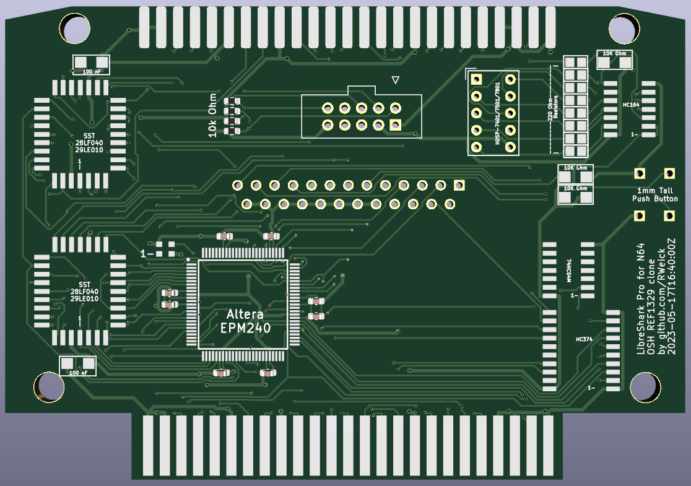

# REF1329-N64-Gameshark-Pro-Clone
This implements the original LZ9FC17 GAL on an Altera EPM240. It fully supports all functionality to include: parallel port, 7 segment display, and the GS button.

The LZ9FC17 GAL is the same for both the N64 Gameshark and the N64 Gameshark Pro. All firmwares work with this clone.

The upper EEPROM contains the high bytes of the BIN, and the lower EEPROM contains the low bytes of the BIN. The 2x5 10 pin connector is mapped to the standard Altera USB Blaster pinout for programming. Happy making.

If you'd like to program the EEPROMs using a Sanni Cart Reader, I've included separate Verilog that will temporarily make the Gameshark compatible with that. You will need to program the device with the Verilog meant for the N64 prior to using it with one.

This is my first foray into Verilog, and I welcome any comments or suggestions about how I could have done it better.

Update (07Sep23): I've discovered that a write of 1E1E to 0x10400400 enables use of the 0x1EE, 0x1EF, and 0x1EC address ranges. These are disabled at first boot. I may add that to my clone chip for completeness' sake, but it's not required.
Unlocking that address range was necessary to add support for the SST 28LF040's to the Sanni Cart Reader, which I've now done. It isn't possible to send the unprotect and protect commands for the eeproms without doing that.

Huge shoutout to @Parasyte for his ceaseless guidance, mentorship, and encouragement, as well as for originally documenting the hardware registers of the N64 Gameshark. This would not exist without him.

Huge shoutout to the [N64Brew](https://n64brew.dev/wiki/Main_Page) community, who have provided countless resources and documentation that enabled me to complete this project.

[Here's a video of it in action.](https://youtu.be/faCqaDdL_ds)

PCB Thickness: 1.2 mm

